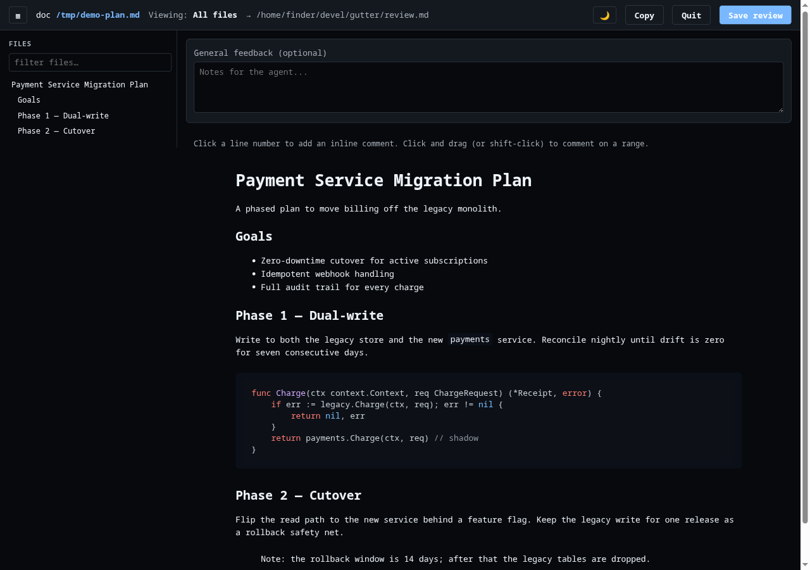

# gutter

> **Note:** this project was highly vibe-coded. Use at your own risk.

A local diff-review tool for collaborating with AI coding agents.

When an agent finishes a change, run `gutter` in your repo. It opens a browser
view of the diff where you click line numbers to leave inline comments and
write a general note at the top. Save to a markdown file (or copy to the
clipboard), then hand the file back to the agent to address. Re-run `gutter`
later and your prior comments come back, marked as "prior", so you can see what
the agent has and hasn't addressed.

Works with both [jj](https://github.com/jj-vcs/jj) and git.


<details>
<summary>Light mode</summary>


</details>

## Features

- Side-by-side line numbers, syntax highlighting, intra-line word diff
- Click a line number (or drag across several) to add a comment
- Comment edits open in a proper modal — no `prompt()` dialogs
- Sidebar with all changed files, +/- counts, and a text filter
- Large files (>80 changed lines, configurable) auto-collapse with a
  click-to-expand banner
- "Open in editor" buttons jump to the file/line in your editor of choice
- Light and dark themes; toggle persists
- Proportional system sans for prose/chrome, bundled JetBrains Mono for code
  and diffs; adjustable UI zoom (see [Typography and zoom](#typography-and-zoom))
- Output is plain markdown — easy to diff, easy for an agent to parse
- Re-running on the same revset reloads existing review notes as "prior
  comments", so you can iterate
- Resolve/unresolve a comment without deleting it — resolved state persists
  in `review.md` across iterations

## Install

Requires Go 1.22+ (bumped from 1.16 to build the `-md` document renderer's
[goldmark](https://github.com/yuin/goldmark) dependency).

```
git clone https://github.com/jself/gutter ~/code/gutter
cd ~/code/gutter
make install                  # installs to $HOME/.local/bin/gutter
# or:  make install PREFIX=/usr/local
```

The default `make install` is **window-enabled** and needs cgo + a system
webview (WebKit2GTK+GTK3 on Linux, system WebKit on macOS, WebView2 on
Windows) — see [Building](#building). If you don't have a system webview,
use `make install-portable` instead (pure Go, no cgo/WebKit; the `-window`
flag then falls back to the browser). Prebuilt portable binaries for all
platforms are also on the [releases page](https://github.com/jself/gutter/releases).

## Quick start

In any jj or git repo:

```
gutter
```

This opens `http://127.0.0.1:<port>` in your browser. Click line numbers to
attach comments, then click **Save review** to write `./review.md` (or
**Copy** to put the markdown on your clipboard).

To feed feedback back to the agent:

```
claude "read review.md and address each comment, updating the code"
# or, with any agent CLI:
codex "read review.md and …"
```

After the agent edits the code, re-run `gutter` — your previous comments load
with an amber **PRIOR** badge so you can tell what's old vs new. Mark the ones
that have been addressed as **Resolved** (or delete them outright), add new
ones, and save again.

## Flags

| Flag | Default | Purpose |
|---|---|---|
| `-r <revset>` | `@` (jj) / working tree (git) | What to diff. jj: a revset, e.g. `main..@`. git: a rev, e.g. `HEAD~3`, or empty for unstaged changes. |
| `-pr <number\|url>` | — | Review a GitHub PR instead of a local diff. See [Reviewing a GitHub PR](#reviewing-a-github-pr). |
| `-md <file>` | — | Render a markdown file as a document instead of reviewing a diff. See [Reviewing a markdown document](#reviewing-a-markdown-document). |
| `-sync` | `false` | One-shot mode for agents: block until Submit, print the review to stdout, write no file. See [Agent sync mode](#agent-sync-mode). |
| `-o <path>` | `review.md` | Output file for the markdown review. |
| `-port <n>` | random | HTTP port to listen on. |
| `-open=false` | `true` | Don't auto-launch the browser. |
| `-dir <path>` | `.` | Directory for the output file. Combine with `-o` to put reviews in e.g. `.claude/`. |
| `-collapse <n>` | `80` | Auto-collapse files with more than N changed lines. `0` disables. |
| `-editor "<tmpl>"` | auto-detected | Editor command template — see below. |
| `-severity` | `false` | Show a severity dropdown on inline comments and emit a trailing `[SEVERITY]` token on inline headings. See [Comment severity](#comment-severity). |
| `-window` | `false` | Open the UI in a native desktop window instead of a browser. Requires a window-enabled build. See [Native window](#native-window). |
| `-version` | | Print the version and exit. |

## Configuration

Every flag has an environment variable and a config-file equivalent. Precedence
(highest wins): CLI flags → env vars → project config (`./.gutter.json`) → user
config (`$XDG_CONFIG_HOME/gutter/config.json`, falling back to
`~/.config/gutter/config.json`) → built-in defaults.

### Environment variables

| Variable | Maps to |
|---|---|
| `GUTTER_REV` | `-r` |
| `GUTTER_PR` | `-pr` |
| `GUTTER_MD` | `-md` |
| `GUTTER_SYNC` | `-sync` (`true` / `false`) |
| `GUTTER_OUTPUT` | `-o` |
| `GUTTER_DIR` | `-dir` |
| `GUTTER_PORT` | `-port` |
| `GUTTER_OPEN` | `-open` (`true` / `false`) |
| `GUTTER_EDITOR` | `-editor` |
| `GUTTER_COLLAPSE` | `-collapse` |
| `GUTTER_SEVERITY` | `-severity` (`true` / `false`) |
| `GUTTER_WINDOW` | `-window` (`true` / `false`) |

### Config file

```jsonc
// ~/.config/gutter/config.json   (or ./.gutter.json for a per-project override)
{
  "rev": "@{u}",
  "pr": "",
  "md": "",
  "sync": false,
  "dir": ".claude",
  "output": "review.md",
  "editor": "nvim --server /tmp/nvim.sock --remote-send ':e {file}<CR>:{line}<CR>'",
  "collapse": 120,
  "open": true,
  "severity": false,
  "window": false
}
```

The example above diffs against upstream (`@{u}`), writes reviews to
`.claude/review.md`, opens links in a running nvim, and collapses files over
120 changed lines. Remove the `"rev"` key (or omit it) to use the default
(working tree for git, `@` for jj).

## Editor templates

`gutter` shells out to your editor when you click "open in editor" on a file or
comment. The template uses `{file}` (absolute path) and `{line}`.

```
-editor "code -g {file}:{line}"
-editor "cursor -g {file}:{line}"
-editor "kitty @ launch --type=tab nvim +{line} {file}"
-editor "nvim --server /tmp/nvim.sock --remote-send ':e {file}<CR>:{line}<CR>'"
```

If `code` or `cursor` is on your PATH, gutter picks one automatically.

## Output format

`review.md` is plain markdown structured for easy parsing:

````markdown
# Review of `@` (jj)

## General feedback

The naming inconsistency between `Connect()` and `Disconnect()` is confusing.

## Inline comments

### src/db/conn.go:42-45

```
+func Connect() error {
+    return nil
+}
```

This should return an actual error if the dial fails — don't swallow it.

### src/main.go:12

```
+    foo := bar.New()
```

Rename to `client` — `foo` is a placeholder name.
````

When you re-run gutter on the same revset, it parses this file back and
reattaches each comment to its line. Comments whose lines no longer exist
(because the code was rewritten) appear in an "unattached prior comments"
panel at the top so you don't lose them.

Both severity and resolved state ride on the inline-comment heading, in a
fixed order — `### path:line-end (LEFT) [SEVERITY] (resolved)` — with each
token optional and independently backward-compatible. A fully-decorated
heading looks like:

```
### src/app.ts:53 [SUGGESTION] (resolved)
```

See [Comment severity](#comment-severity) and
[Resolving comments](#resolving-comments) for details on each token.

## UI cheatsheet

- Click a line number to comment on that line; click-and-drag to comment on
  a range.
- `Cmd/Ctrl+Enter` submits a comment, `Esc` cancels.
- Click a file in the sidebar to filter to just that file (and auto-expand
  it if it was collapsed); click again or "show all files" to clear.
- `☰` toggles the sidebar; `🌙`/`☀` toggles the theme; both persist.
- A 💬 marker on a line number means you've already commented on that line.
- Each saved comment has **Resolve**/**Unresolve** next to edit/delete —
  resolving greys the comment out and strikes through its heading without
  deleting it. See [Resolving comments](#resolving-comments).
- The `[ − 100% + ]` control in the header zooms the whole UI; `Ctrl/Cmd +`,
  `Ctrl/Cmd -`, `Ctrl/Cmd 0` do the same from the keyboard. See
  [Typography and zoom](#typography-and-zoom).

## Workflow notes

### Agent sync mode

`gutter -sync` is a one-shot mode for an agent that runs `gutter` itself and
waits for the review as its command output — no browser-driven human loop
required on the agent's side.

```
gutter -sync
```

Behavior:

- Serves the UI as normal and blocks until you click the single **Submit**
  button (there's no Save/Copy in this mode).
- On Submit, prints the review markdown to **stdout** and exits `0`.
  **`review.md` is not written** — the caller is expected to capture stdout.
- All startup/informational logging (the `gutter:`/`rev:`/`pr:`/`sync:`
  banner lines) goes to **stderr**, so stdout contains only the review
  markdown — safe to pipe or capture directly.
- An empty review is allowed: submitting with no comments prints the
  `_(no feedback)_` placeholder and still exits `0`.
- Pressing Ctrl-C before Submit exits non-zero with nothing on stdout — this
  is how an agent distinguishes "user declined to review" from "user
  submitted an empty review".

### Reviewing a GitHub PR

Requires the [`gh` CLI](https://cli.github.com/) installed and authenticated
(`gh auth status`). Must be run from inside a git or jj repository — running
from a non-repo directory exits with "not a jj or git repository". Run from
inside a local clone of the repo:

```
gutter -pr 123                                          # PR in the current repo
gutter -pr https://github.com/owner/name/pull/123      # PR in any repo
```

The diff shown is fetched from GitHub via `gh pr diff` — your local working
tree is not checked out or touched. You can be on a completely different branch.
Because of this, "open in editor" links may not resolve to the PR's code.

When you save `review.md`, it gains a `## PR` block:

```markdown
## PR

- repo: owner/name
- number: 123
- head: abc1234
- base: def456

NOTE: This is a GitHub PR review. The local working tree is NOT the PR's code —
do not read local files to understand the changes. Use `gh pr diff 123` (or
`gh pr view 123`) to see the actual changes these comments refer to.
To post a comment: `gh` review-comment API — use `head` as the commit id,
`path`/`line` from each comment, side RIGHT for added/context, LEFT for removed.
```

This block tells the agent exactly how to load context and post comments back
via `gh`.

### Reviewing a markdown document

`-md <file>` switches gutter from diff review to document review: it renders
the given markdown file (using [goldmark](https://github.com/yuin/goldmark),
gutter's only Go dependency) as a formatted document instead of a diff.

```
gutter -md docs/plan.md
```



Click any rendered block (paragraph, heading, list item, code fence, etc.) to
leave a comment on it. Block comments anchor to the block's source line range
in the markdown file, so `review.md` keeps the usual `### file:line-end`
format — there's nothing new to parse on the agent side.

Combine with `-sync` for the agent plan-review loop — have the agent write a
plan, then have the human review and approve/annotate it before any code is
touched:

```
gutter -sync -md docs/plan.md
```

This blocks until Submit and prints the review to stdout, same as diff
`-sync` mode; no file is written.

Notes:

- `-md` takes precedence over `-pr`: if both are given, gutter prints a note
  and ignores `-pr`.
- `-md` ignores `-r` — there's no revset to diff in document mode.
- Non-sync doc mode writes `review.md` titled `# Review of <path>` instead of
  the usual `# Review of <revset>`.

### Comment severity

`-severity` (off by default) adds a severity dropdown — `BLOCKING`,
`IMPORTANT`, `SUGGESTION`, `QUESTION`, `NITPICK` (default `QUESTION`) — to
each inline comment. When it's on, `review.md` gains a trailing `[SEVERITY]`
token on inline-comment headings:

```
### src/app.ts:53 [SUGGESTION]

### src/app.ts:120-124 [BLOCKING]
```

With the flag off, output is unchanged from before. Headings without the
token still parse fine (as `QUESTION`), so older `review.md` files and
diffs stay compatible either way. Note the corollary: re-saving with the
flag off writes headings *without* tokens, so severities recorded on an
earlier `-severity` run are dropped from `review.md` on the next save — keep
`-severity` on whenever you want them preserved.

This is aimed at tooling that consumes `gutter -sync` output and wants to
triage by severity — e.g. a centaur-review pipeline that only auto-applies
`NITPICK`/`SUGGESTION` comments but stops for human input on `BLOCKING` ones.

### Resolving comments

Every saved comment has a **Resolve** button next to edit/delete. Resolving
doesn't delete the comment — it stays visible but greyed out with a
struck-through heading, so you (or the agent) can see what's been handled
without losing the record. Click **Unresolve** to bring it back to normal.

Resolved state round-trips through `review.md` as a trailing `(resolved)`
marker on the comment's heading, after any `(LEFT)`/`[SEVERITY]` tokens:

```
### src/app.ts:53 [SUGGESTION] (resolved)
```

This means an agent re-reading `review.md` across iterations can skip
comments already marked `(resolved)` and focus on what's still open. As with
severity, older headings without the marker still parse fine (as
unresolved).

### Native window

`-window` opens the review UI in a native desktop window (via
[`webview_go`](https://github.com/webview/webview_go)) instead of a browser
tab. It composes with everything else — `-md`, `-severity`, `-sync` all work
the same inside the window:

```
gutter -window
gutter -window -sync -md docs/plan.md
```

This requires a **window-enabled build** (see [Building](#building) below).
If you run `-window` on a portable build (no window support compiled in),
gutter prints a warning to stderr and falls back to opening the browser, so
scripts and aliases don't break across machines — the flag just becomes a
no-op.

### Typography and zoom

The UI uses a proportional system sans for prose and chrome (sidebar, buttons,
comments) and the bundled **JetBrains Mono** for code, diffs, and the
markdown/doc-review code fences — the diff itself stays monospace so the
overlay alignment holds. The base font size was bumped up from earlier
versions for readability.

A segmented `[ − 100% + ]` control sits in the header, before the theme
toggle. Click `−`/`+` to zoom out/in, or click the percentage to reset to
100%. Keyboard equivalents work anywhere in the UI:

| Shortcut | Action |
|---|---|
| `Ctrl/Cmd +` | Zoom in |
| `Ctrl/Cmd -` | Zoom out |
| `Ctrl/Cmd 0` | Reset zoom to 100% |

Zoom scales the entire UI (not just text) and persists per browser/window via
`localStorage`, the same as the theme setting. It works both in a regular
browser tab and in the [native window](#native-window).

### Revset examples

#### git

| `-r` value | What it diffs | Equivalent |
|---|---|---|
| _(omitted)_ | Unstaged working tree changes + untracked files | `git diff` |
| `-r --cached` | Staged changes (index vs HEAD) | `git diff --cached` |
| `-r HEAD` | All uncommitted changes (staged + unstaged) | `git diff HEAD` |
| `-r HEAD~3` | Working tree vs 3 commits ago | `git diff HEAD~3` |
| `-r origin/master` | Working tree vs remote master | `git diff origin/master` |
| `-r @{u}` | Working tree vs upstream tracking branch | `git diff @{u}` |
| `-r main` | Working tree vs local main branch | `git diff main` |

#### jj

| `-r` value | What it diffs | Equivalent |
|---|---|---|
| _(omitted)_ | Current change (default `@`) | `jj diff -r @` |
| `-r @-` | Parent change | `jj diff -r @-` |
| `-r 'main..@'` | Whole branch since main | `jj diff -r 'main..@'` |

### Other tips

- For headless workflows, `-open=false -port 8080` gives a stable URL.

## Building

```
make build       # window-enabled build, produces ./gutter
make install     # window-enabled build, installs to $HOME/.local/bin/gutter
make run         # build and run
make clean
```

`make build`/`make install` are the **default, window-enabled** targets:
they build with cgo and the `webview` tag, and require a system webview —
WebKit2GTK + GTK3 on Linux, the system WebKit on macOS, the WebView2 runtime
on Windows. On Linux, the build goes through `scripts/build-window.sh`,
which adds `-tags webview` and, on distros that only ship
`webkit2gtk-4.1` (Arch, modern Fedora/Ubuntu — `webview_go` is pinned to
`webkit2gtk-4.0`), automatically shims the pkg-config dependency from 4.0 to
4.1. So `make build` just works on current Linux without any manual
pkg-config setup, and unmodified on distros that do have `webkit2gtk-4.0`.

If you don't have (or don't want) a system webview, use the portable
targets instead — pure Go, `CGO_ENABLED=0`, no cgo/WebKit, and
cross-compilable:

```
make build-portable                          # produces ./gutter, no cgo
GOOS=linux GOARCH=amd64 make build-portable   # cross-compile
make install-portable
```

`-window` on a portable binary warns and falls back to the browser (see
[Native window](#native-window)). Use the portable targets for releases and
for WebKit-less machines. `go test ./...` needs neither cgo nor WebKit — it
compiles against the pure-Go stub either way.

### Prebuilt releases

`make release` cross-builds the portable (browser-mode) binary for
linux/amd64, linux/arm64, darwin/amd64, darwin/arm64, and windows/amd64 into
`dist/`, alongside a `SHA256SUMS` file:

```
make release                  # dist/gutter-<version>-<os>-<arch> + SHA256SUMS
make release VERSION=v1.2.3   # override the stamped version
```

The version defaults to `git describe` (a short commit hash when there are no
tags) and is stamped into the binary — check it with `gutter -version`. These
are browser-mode binaries; for the native window on Linux, build from source
with `make build` (macOS/Windows window builds must likewise be built on their
own platform, since the webview needs cgo + a system webview).

## License

MIT for gutter's own code.

Bundles [JetBrains Mono](https://www.jetbrains.com/lp/mono/), © the
JetBrains Mono project authors, under the SIL Open Font License 1.1 — see
[`fonts/OFL.txt`](fonts/OFL.txt). The font is embedded in the binary and
served locally, so it works offline.
