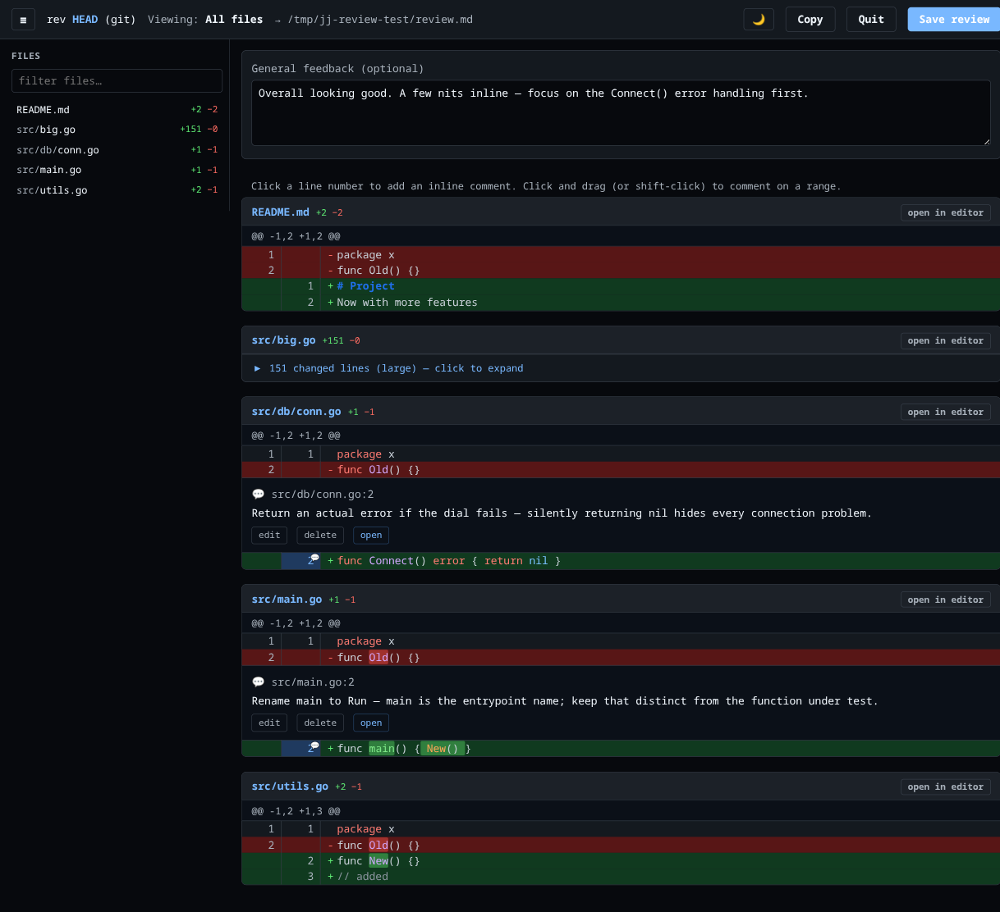
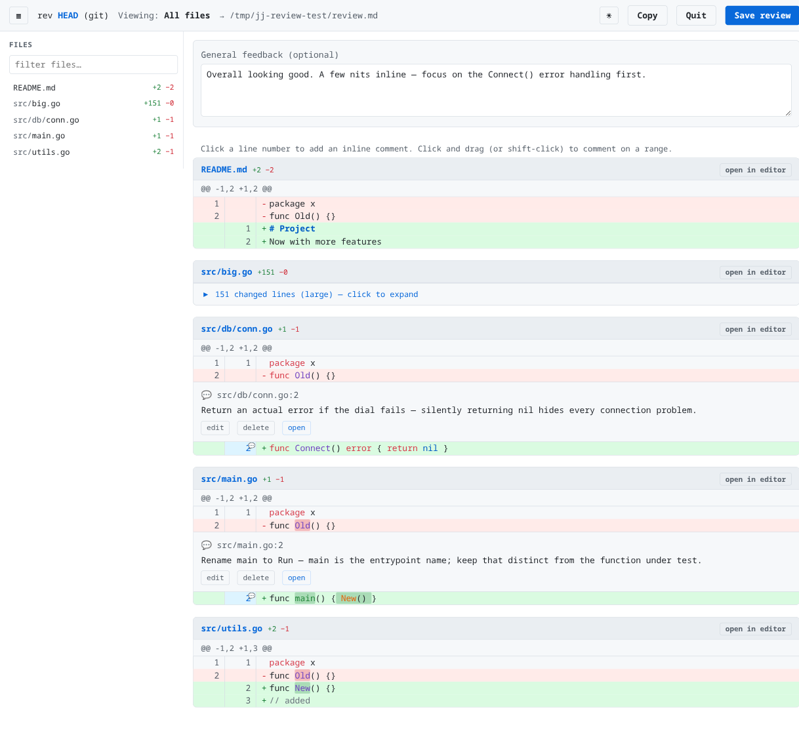

# gutter

> **Note:** this was vibe-coded end-to-end with an AI agent (Claude). I'm
> publishing it because it's useful, not because I wrote it. Use at your own
> risk and feel free to fork/rewrite — I'm not claiming authorship of the code.

A local diff-review tool for collaborating with AI coding agents.

When an agent finishes a change, run `gutter` in your repo. It opens a browser
view of the diff where you click line numbers to leave inline comments and
write a general note at the top. Save to a markdown file (or copy to the
clipboard), then hand the file back to the agent to address. Re-run `gutter`
later and your prior comments come back, marked as "prior", so you can see what
the agent has and hasn't addressed.

Works with both [jj](https://github.com/jj-vcs/jj) and git.



<details>
<summary>Light mode</summary>



</details>

## Features

- Side-by-side line numbers, syntax highlighting, intra-line word diff
- Click a line number (or drag across several) to add a comment
- Comment edits open in a proper modal — no `prompt()` dialogs
- Sidebar with all changed files, +/- counts, and a text filter
- Large files (>80 changed lines, configurable) auto-collapse with a
  click-to-expand banner
- "Open in editor" buttons jump to the file/line in your editor of choice
- Light and dark themes; toggle persists
- Output is plain markdown — easy to diff, easy for an agent to parse
- Re-running on the same revset reloads existing review notes as "prior
  comments", so you can iterate

## Install

Requires Go 1.21+.

```
git clone https://github.com/jself/gutter ~/code/gutter
cd ~/code/gutter
make install                  # installs to $HOME/.local/bin/gutter
# or:  make install PREFIX=/usr/local
```

## Quick start

In any jj or git repo:

```
gutter
```

This opens `http://127.0.0.1:<port>` in your browser. Click line numbers to
attach comments, then click **Save review** to write `./review.md` (or
**Copy** to put the markdown on your clipboard).

To feed feedback back to the agent:

```
claude "read review.md and address each comment, updating the code"
# or, with any agent CLI:
codex "read review.md and …"
```

After the agent edits the code, re-run `gutter` — your previous comments load
with an amber "prior" tag so you can tell what's old vs new. Delete the ones
that have been addressed, add new ones, and save again.

## Flags

| Flag | Default | Purpose |
|---|---|---|
| `-r <revset>` | `@` (jj) / `@{u}` (git) | What to diff. jj: a revset, e.g. `main..@`. git: a rev, e.g. `HEAD~3`. |
| `-o <path>` | `review.md` | Output file for the markdown review. |
| `-port <n>` | random | HTTP port to listen on. |
| `-open=false` | `true` | Don't auto-launch the browser. |
| `-dir <path>` | `.` | Directory for the output file. Combine with `-o` to put reviews in e.g. `.claude/`. |
| `-collapse <n>` | `80` | Auto-collapse files with more than N changed lines. `0` disables. |
| `-editor "<tmpl>"` | auto-detected | Editor command template — see below. |

## Configuration

Every flag has an environment variable and a config-file equivalent. Precedence
(highest wins): CLI flags → env vars → project config (`./.gutter.json`) → user
config (`$XDG_CONFIG_HOME/gutter/config.json`, falling back to
`~/.config/gutter/config.json`) → built-in defaults.

### Environment variables

| Variable | Maps to |
|---|---|
| `GUTTER_REV` | `-r` |
| `GUTTER_OUTPUT` | `-o` |
| `GUTTER_DIR` | `-dir` |
| `GUTTER_PORT` | `-port` |
| `GUTTER_OPEN` | `-open` (`true` / `false`) |
| `GUTTER_EDITOR` | `-editor` |
| `GUTTER_COLLAPSE` | `-collapse` |

### Config file

```jsonc
// ~/.config/gutter/config.json   (or ./.gutter.json for a per-project override)
{
  "dir": ".claude",
  "output": "review.md",
  "editor": "nvim --server /tmp/nvim.sock --remote-send ':e {file}<CR>:{line}<CR>'",
  "collapse": 120,
  "open": true
}
```

The example above writes reviews to `.claude/review.md`, opens links in a
running nvim, and collapses files over 120 changed lines.

## Editor templates

`gutter` shells out to your editor when you click "open in editor" on a file or
comment. The template uses `{file}` (absolute path) and `{line}`.

```
-editor "code -g {file}:{line}"
-editor "cursor -g {file}:{line}"
-editor "kitty @ launch --type=tab nvim +{line} {file}"
-editor "nvim --server /tmp/nvim.sock --remote-send ':e {file}<CR>:{line}<CR>'"
```

If `code` or `cursor` is on your PATH, gutter picks one automatically.

## Output format

`review.md` is plain markdown structured for easy parsing:

```markdown
# Review of `@` (jj)

## General feedback

The naming inconsistency between `Connect()` and `Disconnect()` is confusing.

## Inline comments

### src/db/conn.go:42-45

```
+func Connect() error {
+    return nil
+}
```

This should return an actual error if the dial fails — don't swallow it.

### src/main.go:12

```
+    foo := bar.New()
```

Rename to `client` — `foo` is a placeholder name.
```

When you re-run gutter on the same revset, it parses this file back and
reattaches each comment to its line. Comments whose lines no longer exist
(because the code was rewritten) appear in an "unattached prior comments"
panel at the top so you don't lose them.

## UI cheatsheet

- Click a line number to comment on that line; click-and-drag to comment on
  a range.
- `Cmd/Ctrl+Enter` submits a comment, `Esc` cancels.
- Click a file in the sidebar to filter to just that file (and auto-expand
  it if it was collapsed); click again or "show all files" to clear.
- `☰` toggles the sidebar; `🌙`/`☀` toggles the theme; both persist.
- A 💬 marker on a line number means you've already commented on that line.

## Workflow notes

- Default jj revset is `@` (current change) — matches `jj status`. For
  reviewing a whole branch use `-r 'main..@'` or similar.
- Default git rev is `@{u}` (vs upstream). Use `-r HEAD~3` for the last
  three commits, or `-r main` for branch-vs-main.
- For headless workflows, `-open=false -port 8080` gives a stable URL.

## Build from source

```
make build       # produces ./gutter
make run         # build and run
make clean
```

## License

MIT
